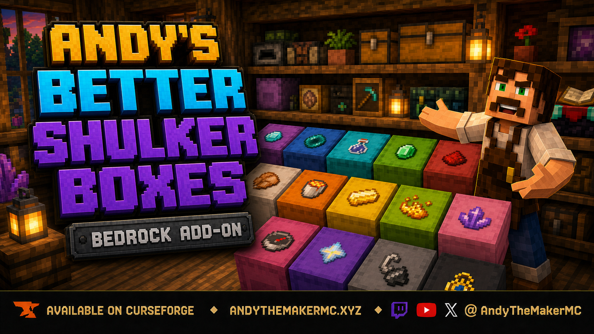

  

# Andy's Better Shulker Boxes

**Removable visual item labels for faster Minecraft Bedrock storage.**

Andy's Better Shulker Boxes adds clear, removable item labels to placed shulker boxes. Hold the item you want to use as a label, sneak, and interact with the shulker box. One item is stored in the label and its familiar vanilla icon appears flat on the box's upward-facing surface, making ores, food, redstone, tools, building blocks, and other supplies recognizable without opening every container.

The add-on is useful in storage rooms, workshops, mobile bases, multiplayer warehouses, and color-coded sorting systems. Labels can be replaced or removed at any time, and the stored item is safely returned when the label is changed, removed, or the shulker box is broken.

## Download

[Download Andy's Better Shulker Boxes 1.0.12](Andys_Better_Shulker_Boxes_1.0.12.mcaddon)

Minecraft Bedrock **1.21.120 or newer** is required. Cheats, commands, and experimental gameplay toggles are not required.

## Important Current Placement Limitation

Labels currently display only on the surface that faces **upward in the game world**. Upright shulker boxes work as intended, but a shulker attached to a wall or ceiling will not display the label on its actual lid face.

For now, place shulker boxes upright with the surface you want to label facing the sky. A future update is planned to support reliable placement on the shulker box's actual oriented lid face.

The add-on includes a large generated catalog of current vanilla Bedrock item icons, but every item has not been manually tested in-game. If an item appears blank, displays the wrong icon, or falls back to paper, please open an issue or leave a comment on the official CurseForge project with the item name, Minecraft version, device, and add-on version.

## Features

- Removable item-icon labels for placed shulker boxes
- Sneak-and-interact controls inspired by vanilla Item Frames
- Flat, centered labels that remain readable from above
- Support for undyed shulker boxes and all 16 dyed colors
- Large generated catalog of current vanilla Bedrock item icons
- One real item stored per label
- Automatic return of the previous item when replacing a label
- Empty-hand removal that returns the label item
- Safe item recovery when a labeled shulker box is broken
- Persistent labels across world reloads
- Automatic cleanup of orphaned label displays
- Overworld, Nether, and End support
- Single-player, multiplayer, Realm, and supported Bedrock-server compatibility
- Standard graphics and Vibrant Visuals compatibility
- No required dependencies
- No Cheats, commands, or experimental gameplay toggles required

## Installation

### Windows, Android, iPhone, and iPad

1. Download `Andys_Better_Shulker_Boxes_1.0.12.mcaddon` from this repository.
2. Open the downloaded file with Minecraft Bedrock.
3. Wait for Minecraft to confirm that both included packs imported successfully.
4. Create a world, or edit the world where you want to use the add-on.
5. Open **Behavior Packs → My Packs**.
6. Activate **Andy's Better Shulker Boxes BP**.
7. Confirm that **Andy's Better Shulker Boxes RP** is active under Resource Packs. Minecraft should activate the linked pack automatically.
8. Enter the world and place an upright shulker box.

Back up an important world before installing or updating any add-on.

### Xbox, PlayStation, and Nintendo Switch

Consoles generally cannot import arbitrary local `.mcaddon` files directly. Import and activate the add-on on Windows or mobile, upload the prepared world to a Realm, and join that Realm from the console. Realm members receive the world's required packs through Minecraft's normal world-pack delivery.

## How to Use

### Apply a label

1. Place a shulker box upright.
2. Select the item you want to use as its label.
3. Sneak or crouch.
4. Interact directly with the shulker box while holding the item.
5. One item is removed from the held stack and its icon appears on the upward-facing surface.

Interact without sneaking whenever you want to open the shulker normally.

### Replace a label

1. Select the new label item.
2. Sneak and interact with the labeled shulker box.
3. The previous label item is returned first.
4. One item from the new stack becomes the replacement label.

### Remove a label

1. Select an empty hotbar slot.
2. Sneak or crouch.
3. Interact with the labeled shulker box or its visible icon.
4. The icon disappears and the stored label item returns to your inventory.

If the inventory cannot accept the returned item, Minecraft drops it safely nearby rather than deleting it.

### Break or move a labeled shulker

Break the shulker normally. The add-on removes the visual label and returns the stored label item. Place the shulker again and apply a new label after choosing its final position.

## Compatibility and Technical Notes

- Minecraft Bedrock 1.21.120 or newer
- Both included packs must remain active at the same version
- Standard graphics and Vibrant Visuals
- Single-player, multiplayer, Realms, and supported Bedrock servers
- No required dependencies
- No experimental gameplay toggles
- No commands or Cheats required

Bedrock does not expose a stable arbitrary `ItemStack` renderer to custom add-on entities. The add-on maps vanilla item IDs to their normal Mojang texture paths and renders those familiar icons on a thin label surface. Items from other add-ons use the paper fallback until their texture path is added. Enchantment glint and durability-state visuals are not reproduced on the flat label.

Labels are visible only on shulker boxes placed in the world. The add-on does not change portable shulker-box icons or add dynamic previews to the normal inventory, chest, or hotbar interfaces.

## Troubleshooting

### The label was applied but is invisible

- Confirm that the shulker is upright and check its upward-facing world surface.
- Confirm that **Andy's Better Shulker Boxes RP** is active.
- Confirm that both included packs show the same version.
- Completely leave and reopen the world after changing packs.
- Remove older copies under **Minecraft Settings → Storage**.
- Test once with other shulker-changing or PBR Resource Packs disabled.

### The wrong icon appears or the label looks like paper

- Confirm that the item is a vanilla Minecraft item.
- Reapply it after confirming both packs are current.
- Report the exact item name, Minecraft version, device, add-on version, and a screenshot when possible.

### Sneak-interacting does not apply a label

- Hold a real item in the selected hotbar slot.
- Continue sneaking while interacting directly with the shulker box.
- Confirm that the Behavior Pack is active.
- Test with a common item such as a Diamond, Apple, Compass, or Redstone Dust.

See the [project wiki](../../wiki) for the complete installation, usage, compatibility, and troubleshooting guides.

## Follow and Support Andy

Visit [AndyTheMakerMC.xyz](https://AndyTheMakerMC.xyz) for Andy's add-ons, world lore, tutorials, guides, videos, and other Minecraft content.

Follow **@AndyTheMakerMC** on:

- [YouTube](https://www.youtube.com/@AndyTheMakerMC)
- [Twitch](https://twitch.tv/AndyTheMakerMC)
- [X](https://x.com/AndyTheMakerMC)
- [TikTok](https://www.tiktok.com/@AndyTheMakerMC)
- [Instagram](https://www.instagram.com/AndyTheMakerMC)

Support future projects through [Ko-fi](https://ko-fi.com/andythemaker) or a [direct Stripe contribution](https://buy.stripe.com/4gM4gz0qu0xwgxw0IfcMM00).

## Player, Server, Realm, and Content Creator Permission

Players may use an official, unmodified release of Andy's Better Shulker Boxes in personal worlds, multiplayer worlds, Realms, and servers. Normal delivery of the official, unmodified add-on to players joining an authorized world, Realm, or server is permitted.

Content creators may use, review, and showcase an official, unmodified release in worlds, multiplayer worlds, Realms, servers, videos, livestreams, screenshots, tutorials, reviews, showcases, articles, guides, social posts, and other original gameplay content, including monetized content.

Credit to **AndyTheMakerMC** and a link to the official project page are appreciated whenever practical.

These permissions do not allow anyone to offer the add-on file as a separate download or to modify, translate, adapt, decompile, disassemble, reverse engineer, extract, repackage, mirror, rehost, resell, sublicense, redistribute, or reuse any project content.

## All Rights Reserved License

**All Rights Reserved. Copyright © 2026 Andy / AndyTheMakerMC.**

Except for the limited player, server, Realm, and content-creator permissions above, no part of the add-on, documentation, branding, textures, models, or promotional artwork may be redistributed, reuploaded, rehosted, mirrored, resold, sublicensed, bundled, repackaged, modified and published, translated, adapted, decompiled, disassembled, reverse engineered, extracted, reused, or incorporated into another add-on, pack, application, website, download, or project without prior written permission from the copyright holder.

The promotional artwork is original AI-assisted concept artwork directed for this project. It is not an in-game screenshot.

Minecraft is a trademark of Microsoft Corporation. This project is not affiliated with, endorsed by, sponsored by, or associated with Microsoft or Mojang Studios.
