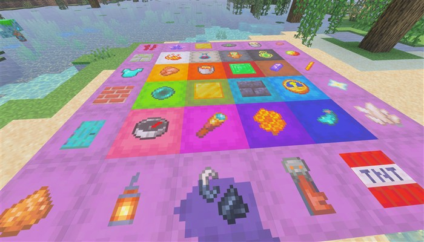
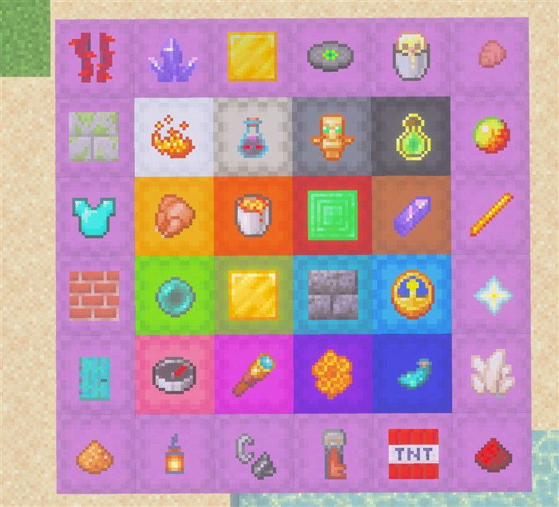
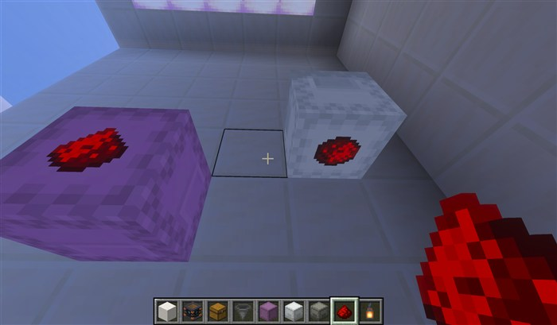

  

# Andy's Better Shulker Boxes

**Put a removable item label on the exact shulker-box face you choose.**

Andy's Better Shulker Boxes makes storage readable at a glance. Sneak-use an item on any placed shulker box to display that item's familiar icon on the clicked face. The real item is kept safely in the label, survives chunk unloads, and stays attached when the shulker is picked up and placed again.

  

_Use color for broad categories and item labels for the exact contents._

**Current release:** 1.1.7

**Download:** [Andys_Better_Shulker_Boxes_1.1.7.mcaddon](Andys_Better_Shulker_Boxes_1.1.7.mcaddon)

**SHA-256:** `E054B2951331B91892ABF29CAE6C7439952DD63B3626DA69E9D93C2576B3D1D4`

Minecraft Bedrock **1.21.120 or newer** is required. Both included packs must be active. No cheats, commands, experimental gameplay toggles, or additional dependencies are required. Standard graphics and Vibrant Visuals are supported.

The complete player documentation is in the [GitHub Wiki](https://github.com/CharlesJGantt/Andys-Better-Shulker-Boxes/wiki).

## Features

- One removable item-icon label on each placed shulker box
- Placement on the clicked top, bottom, north, south, east, or west face
- Player-facing orientation for labels on horizontal faces
- Support for normal shulker boxes and all 16 dyed colors
- Labels that remain safe when their chunk unloads
- Labels that stay attached when the shulker is mined, carried, and placed again
- Exact preservation of the label item's name, lore, enchantments, durability, and other stored data
- Safe return when a label is removed or replaced, with a nearby ground drop if inventory space is unavailable
- Recovery of the label item when the label or placed shulker is destroyed without a portable shulker drop
- Overworld, Nether, End, single-player, multiplayer, Realm, and compatible server support

  

## Installation

### Windows, Android, iPhone, and iPad

1. Download [Andys_Better_Shulker_Boxes_1.1.7.mcaddon](Andys_Better_Shulker_Boxes_1.1.7.mcaddon).
2. Open it with Minecraft Bedrock and wait for both packs to import.
3. Create or edit a world.
4. Activate **Andy's Better Shulker Boxes BP** under Behavior Packs.
5. Confirm **Andy's Better Shulker Boxes RP** is active under Resource Packs.
6. Place a shulker box, hold a label item, then sneak and interact with the face you want to label.

Back up an important world before installing or updating any add-on.

### Xbox, PlayStation, and Nintendo Switch

Import and activate the add-on on Windows or mobile, upload the prepared world to a Realm, and join that Realm from the console.

## Controls and behavior

1. **Apply a label:** Hold the item you want to display, sneak, and interact with a placed shulker. One item becomes the label on the face you clicked.
2. **Replace a label:** Hold a different item, sneak, and interact again. The original item is returned before the new label is stored.
3. **Remove a label:** Use an empty hand while sneaking and interact with the shulker or visible label. The exact stored item returns to your inventory or drops nearby.
4. **Move a labeled shulker:** Mine it normally. The label remains attached to the dropped shulker item, including its face, rotation, and exact item data, then restores when placed again.
5. **Open the shulker:** Interact without sneaking to use the normal shulker inventory.

Floor-placed shulkers accept labels on the top and four sides. Wall-placed shulkers accept labels on their player-facing top and four sides. Ceiling-placed shulkers accept labels on their downward-facing top and four sides.

  

## Compatibility and limitations

- Minecraft Bedrock 1.21.120 or newer
- Matching Behavior and Resource Packs are required
- Standard graphics and Vibrant Visuals/PBR
- Single-player, multiplayer, Realms, and compatible Bedrock servers
- No cheats, commands, experimental toggles, or required dependencies
- Vanilla item icons use the generated texture catalogue; unsupported add-on items use the paper fallback
- The flat icon does not reproduce enchantment glint or durability-state artwork, although the stored item retains that data
- Labels appear on placed shulkers; normal inventory, chest, and hotbar shulker icons are unchanged

See [Compatibility and Troubleshooting](https://github.com/CharlesJGantt/Andys-Better-Shulker-Boxes/wiki/Compatibility-and-Troubleshooting) for detailed diagnostics.

## Support AndyTheMakerMC

All of my Minecraft Bedrock add-ons are free to download and use. If one of my add-ons has improved your world, saved you time, or added something you wish Minecraft already had, consider supporting continued development. Your support helps fund the time and tools required to maintain existing add-ons, test new Minecraft Bedrock releases, fix bugs, create documentation and artwork, and continue building new add-ons.

**Help me keep these add-ons free, updated, and actively maintained** — support through [Buy Me a Coffee](https://www.buymeacoffee.com/AndyTheMakerMC) or a direct donation through [Stripe](https://buy.stripe.com/4gM4gz0qu0xwgxw0IfcMM00). Prefer another way? [Ko-fi](https://ko-fi.com/andythemaker) · [Patreon](https://www.patreon.com/cw/AndyTheMakerMC) · [GitHub Sponsors](https://github.com/sponsors/CharlesJGantt). Every bit of support is appreciated, but it is never required.

Enjoying the add-on? Ratings, favorites, recommendations, and kind comments also help more Bedrock players discover Andy's work.

### Explore more of Andy's add-ons

Visit [AndyTheMakerMC.xyz](https://andythemakermc.xyz/) for more Minecraft Bedrock add-ons, `.mcstructure` downloads, HoloPrint files, world lore, tutorials, guides, videos, and other creations.

### Follow AndyTheMakerMC

Follow **@AndyTheMakerMC** for new add-on releases, development updates, tutorials, showcases, streams, and more Minecraft adventures, and join the community on Discord and Facebook:

- [YouTube](https://www.youtube.com/@AndyTheMakerMC)
- [Twitch](https://www.twitch.tv/AndyTheMakerMC)
- [TikTok](https://www.tiktok.com/@AndyTheMakerMC)
- [Instagram](https://www.instagram.com/andythemakermc/)
- [X (Twitter)](https://x.com/AndyTheMakerMC)
- [Discord](https://discord.gg/KVFNHf67Y)
- [Facebook Group](https://www.facebook.com/groups/1728623358327048)

## End-user permission

You may download the official, unmodified release of Andy's Better Shulker Boxes from its official CurseForge or authorized GitHub project page and install, activate, and use it in personal single-player worlds, multiplayer worlds, Realms, and compatible Bedrock servers.

This permission includes Minecraft's normal automatic delivery of the official, unmodified add-on to players joining a world, Realm, or server where it is active. It does not permit offering the add-on file separately or distributing it as part of a world download, modpack, bundle, mirror, archive, or server download.

## Content-creator permission

Content creators may use an official, unmodified release of Andy's Better Shulker Boxes in original gameplay videos, livestreams, screenshots, tutorials, reviews, showcases, articles, guides, social posts, and other original content, including monetized content.

Credit to **AndyTheMakerMC** and a link to the official CurseForge project page are appreciated whenever practical. This permission covers display of normal gameplay and commentary; it does not grant permission to redistribute, modify, extract, or republish the add-on or its assets.

## License — All Rights Reserved

**All Rights Reserved. Copyright © 2026 Andy / AndyTheMakerMC.**

You may not redistribute, reupload, rehost, mirror, resell, sublicense, bundle, repackage, modify and publish, translate, adapt, decompile, disassemble, reverse engineer, extract, or reuse the add-on, its source code, scripts, documentation, branding, textures, models, pack icons, or promotional artwork without prior written permission from the copyright holder.

You may not create derivative works or incorporate any portion of the project into another add-on, Behavior Pack, Resource Pack, application, product, modpack, download, or project without prior written permission. The end-user and content-creator permissions above are limited permissions; they do not transfer ownership or grant redistribution rights.

The promotional artwork is original AI-assisted concept artwork directed for this project. It is not an in-game screenshot.

Minecraft is a trademark of Microsoft Corporation. This project is not affiliated with, endorsed by, sponsored by, or associated with Microsoft or Mojang Studios.

See [LICENSE.md](LICENSE.md) for the complete license and permitted-use terms.
